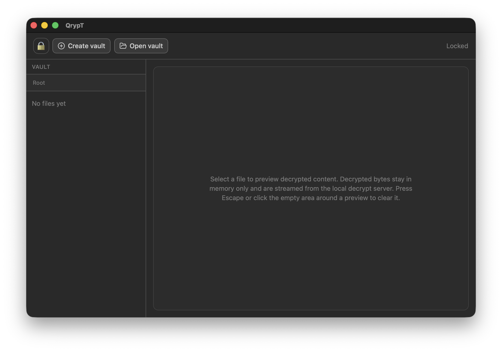
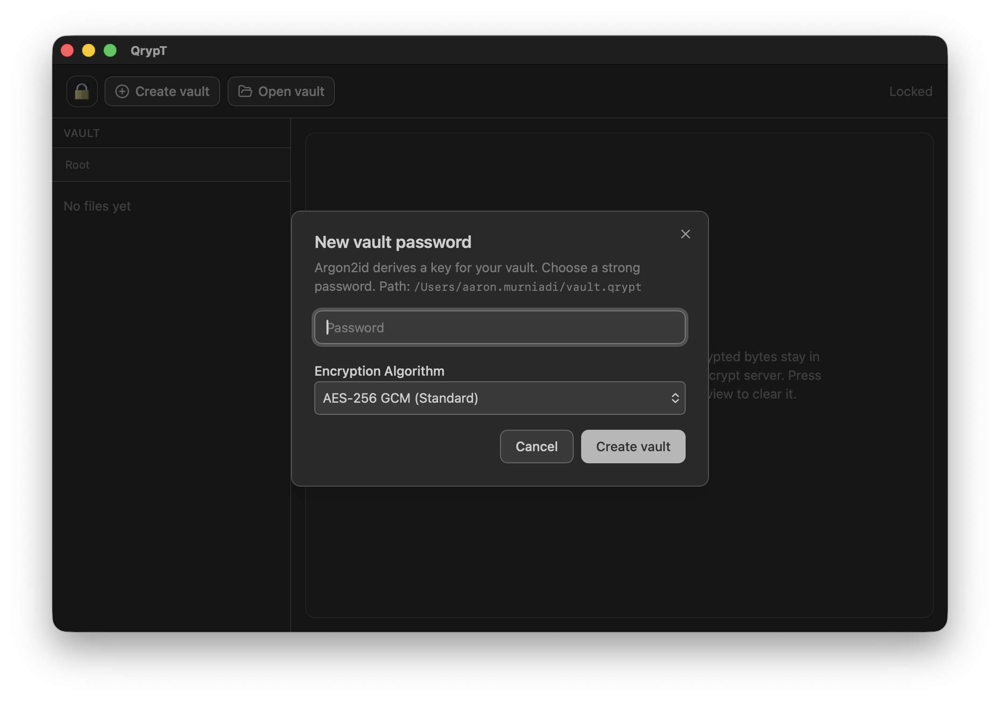

# QrypT

<div align="center">




**Version**: 0.3.0

[](https://wails.io/)
[](https://golang.org/)
[](https://reactjs.org/)
[](LICENSE)


</div>

**QrypT** is a modern, secure file vault application built with Go and React. It provides military-grade encryption for your sensitive files with an elegant, intuitive interface.

> **🚧 Alpha Version Notice**: QrypT is currently in alpha development. Features may be incomplete, and there may be bugs. Please use with caution and do not store critical production data in this version.

## ⚠️ Disclaimer

**QrypT** is provided as-is for educational and personal use. No security system can guarantee absolute protection. Users are responsible for:

- Keeping their vault passwords secure and confidential
- Maintaining secure backups of their encrypted vault files
- Understanding that lost passwords cannot be recovered - encrypted data will be permanently inaccessible

The author and contributors of QrypT accept no liability for any data loss, security breaches, or damages resulting from the use of this software. For highly sensitive data, consider using multiple layers of security and consult with security professionals.

## ✨ Features

- 🧠 **In-Memory Decryption**: Files are decrypted entirely in memory with no temporary disk writes
- 🔐 **Military-Grade Encryption**: AES-256-GCM encryption with Argon2 key derivation
- 🎯 **Cross-Platform**: Native desktop app for Windows, macOS, and Linux
- ⚡ **Lightning Fast**: Built with Go for performance, React for modern UI
- 🔒 **Secure by Default**: Offline architecture - your data never leaves your device
- 🎨 **Beautiful Interface**: Clean, modern design built with Tailwind CSS and shadcn/ui
- 🎬 **Rich Media Support**: Preview images, videos, and text files directly in the vault
- 📁 **Organized Storage**: Create folders and organize files with drag-and-drop


## 📋 Release Notes

### [0.3.0] - 2026-04-10

#### Added
- **Twofish-256 XTS**: New encryption algorithm option for advanced security
- **Algorithm Selection**: Users can now choose between AES-256 GCM, Serpent-256 XTS, and Twofish-256 XTS when creating new vaults

#### Changed
- **Backend**: Updated `FinalizeNewVault` to accept algorithm parameter
- **Frontend**: Refactored create vault dialog into separate component with algorithm selector

### [0.2.1] - 2026-04-10

#### Added
- **Add File Dialog**: New modal dialog for adding files with drag-and-drop area and system file picker
- **URL Download**: Download files directly from URLs and save them to the vault

### [0.2.0] - 2026-04-10

#### Changed
- **Security & Privacy**: Transitioned to in-memory file decryption via Wails IPC, removing the reliance on a local HTTP server for file previews
- **UI/UX**: Refined the vault sidebar, file selection UI, and enhanced loading states/transitions for media previews
- **Branding**: Updated app icon and branding throughout the application

#### Added
- **Features**:
  - Added "Copy link" functionality to generate one-time download links for files
  - Added image preview support in the vault
- **Logging**: Implemented comprehensive logging system for both backend (using `zerolog`) and frontend
- **Documentation**: Updated README with screenshots and detailed feature descriptions
- **GitHub Actions**: Added automated release workflow for cross-platform builds

#### Removed
- Removed legacy embedded assets (`embed/qrypt.png`)

## 🤝 Contributing

Contributions are welcome! Whether you're fixing bugs, adding features, improving documentation, or reporting issues, your help is appreciated.

**How to contribute:**

1. **Fork** the repository
2. **Create a feature branch** (`git checkout -b feature/amazing-feature`)
3. **Commit your changes** (`git commit -m 'Add amazing feature'`)
4. **Push to the branch** (`git push origin feature/amazing-feature`)
5. **Open a Pull Request**

**Areas where help is especially needed:**
- 🐛 Bug fixes and testing
- 🌐 Cross-platform compatibility testing
- 📚 Documentation improvements
- 🎨 UI/UX enhancements
- 🔒 Security reviews and improvements

## Development

Run the app in development mode with hot reload:

```bash
wails dev
```

The frontend dev server runs on http://localhost:5173 with Vite's fast HMR.

## Building

### Current Platform
```bash
wails build
# or
./scripts/build.sh
```

### Cross-Platform Builds
```bash
# Build for all platforms
./scripts/build-all.sh

# Individual platforms
./scripts/build-windows.sh      # Windows AMD64
./scripts/build-linux.sh         # Linux AMD64
./scripts/build-macos-arm.sh     # macOS Apple Silicon
./scripts/build-macos-intel.sh   # macOS Intel
./scripts/build-macos-universal.sh  # macOS Universal Binary
```

Built applications will be in `build/bin/`

## shadcn/ui Components

This template includes pre-configured shadcn/ui components:
- Button
- Input
- Label
- Card

Add more components:
```bash
cd frontend
npx shadcn@latest add [component-name]
```

Browse components at [ui.shadcn.com](https://ui.shadcn.com/)